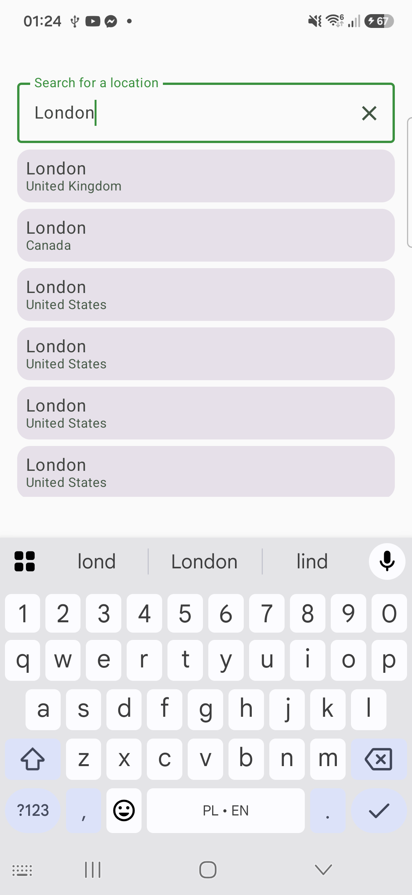
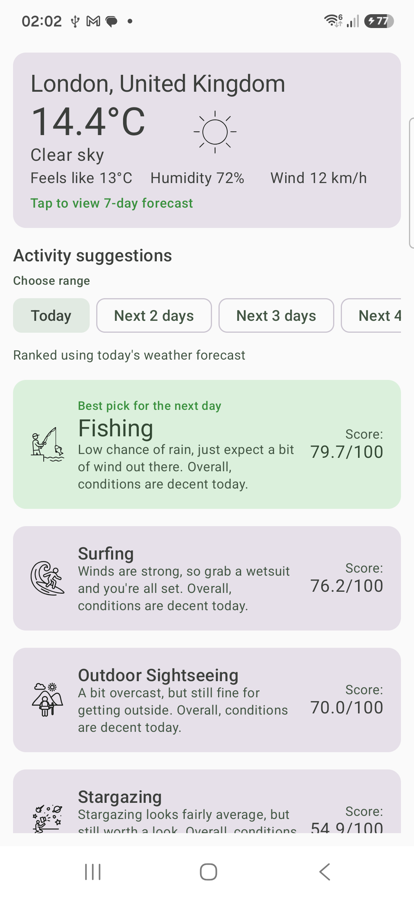
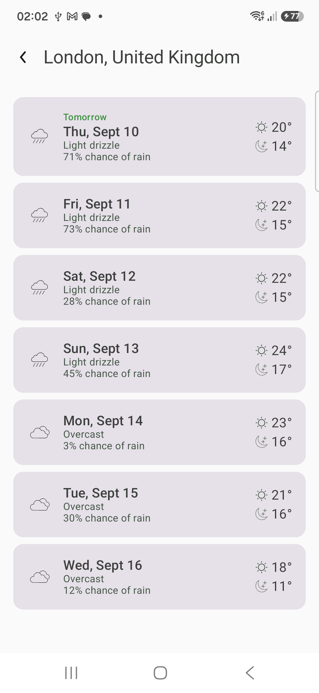
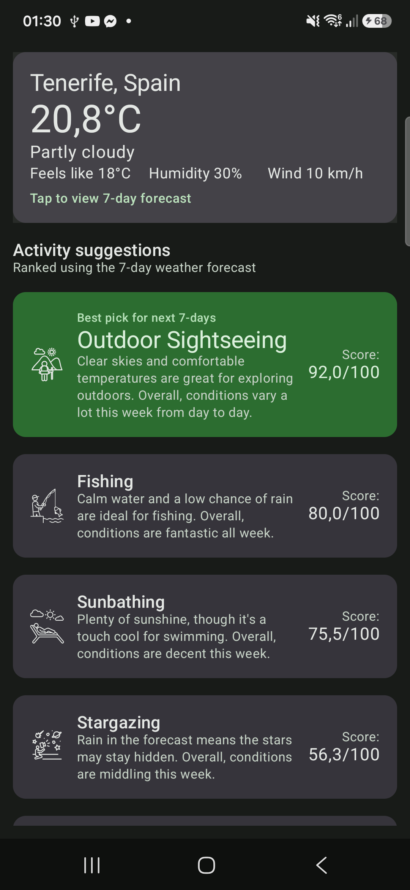

# Weather Activity Planner

[](https://github.com/Opelpe/weather-activity-planner/actions/workflows/android-tests.yml)
[](LICENSE)
[](https://developer.android.com/about/versions/10)
[](https://kotlinlang.org)

A native Android app that lets you search for a city and see a **ranked list of activities**
(Skiing, Surfing, Outdoor Sightseeing, Indoor Sightseeing, Cycling, Sunbathing, Stargazing,
Fishing) suitable for that location over the **next 7 days**, based on live weather forecast data
from [Open-Meteo](https://open-meteo.com/).

---

## Demo

<table>
  <tr>
    <td align="center">
      <a href="docs/screenshots/1-location-search.png"></a>
      <br/><sub><b>Location Search</b></sub>
    </td>
    <td align="center">
      <a href="docs/screenshots/2-location-search-london.png"></a>
      <br/><sub><b>Searching "London"</b></sub>
    </td>
    <td align="center">
      <a href="docs/screenshots/3-activity-recommendations.png"></a>
      <br/><sub><b>Activity Recommendations</b></sub>
    </td>
    <td align="center">
      <a href="docs/screenshots/4-weekly-forecast.png"></a>
      <br/><sub><b>7-Day Forecast</b></sub>
    </td>
    <td align="center">
      <a href="docs/screenshots/5-activity-recommendations-dark.png"></a>
      <br/><sub><b>Recommendations (Dark)</b></sub>
    </td>
  </tr>
</table>

<p align="center">
  <video src="https://github.com/user-attachments/assets/b4a500a5-7a16-4938-ba3b-cad5265f67b1" width="360" controls></video>
</p>

---

## a. Project Overview

The app has three screens:

1. **Location Search** - debounced search-as-you-type against the Open-Meteo Geocoding API,
   returning up to 20 matching cities with country/region.
2. **Activity Recommendations** - for the selected city: current weather conditions plus all
   eight activities ranked best-to-worst for the coming week, each with a 0–100 score (shown to
   one decimal) and a combined weekly + daily reason. Pull-to-refresh and a "stale data" snack bar
   (with a retry action) surface when a cached forecast is shown because of a network failure or
   lost connectivity.
3. **7-Day Forecast** - a day-by-day breakdown of the forecast used to compute the rankings
   (condition, temperature range, etc.), reached by tapping the current-weather card.

Both the recommendations and forecast screens support pull-to-refresh, retry-on-error, and
light/dark themes.

---

## b. Platform & Tooling Choices

| Property                           | Value                                                                      |
|------------------------------------|----------------------------------------------------------------------------|
| Platform                           | Android (native, Kotlin)                                                   |
| UI                                 | Jetpack Compose + Material 3                                               |
| Min SDK / Target SDK / Compile SDK | 29 / 37 / 37                                                               |
| JVM target                         | 17                                                                         |
| Kotlin                             | 2.3.21                                                                     |
| AGP                                | 9.2.1                                                                      |
| DI                                 | Hilt 2.59.2                                                                |
| Networking                         | Retrofit 3 + OkHttp 5 + Moshi (kotlin codegen)                             |
| Async                              | Kotlin Coroutines & Flow                                                   |
| Navigation                         | Jetpack Navigation Compose with type-safe (`kotlinx.serialization`) routes |
| Testing                            | JUnit4, MockK, Turbine, kotlinx-coroutines-test                            |

All dependency versions are centralized in `gradle/libs.versions.toml` (version catalog) - no
hardcoded versions in module `build.gradle.kts` files.

---

## c. Architecture & Technical Decisions

### Clean Architecture, 3 modules

- **`:domain`** is a plain `java-library` module: domain models, repository *interfaces*, use
  cases, the activity-ranking engine (an `ActivityDayScorer` per activity plus the
  `ActivitiesRankingCalculator`), and `DomainError`. It has no Android, Retrofit, or Moshi imports
  - it is unit-testable on the plain JVM with zero mocking of the framework.
- **`:data`** implements the domain repository interfaces using Retrofit/Moshi, an in-memory LRU
  forecast cache, and a `ConnectivityManager`-backed connectivity repository. DTOs and the
  Retrofit service interfaces are `internal` - they never leak outside this module. Mapper
  extension functions (`toDomain()`) convert DTOs to domain models, and `toDomainError()`/
  `toDomainResult()` convert exceptions to `DomainError`.
- **`:app`** contains Compose screens, ViewModels, Hilt setup, navigation, theme, and string
  resources. It depends on `:domain` directly for models/use cases, and on `:data` only via Hilt
  bindings (it never instantiates a repository implementation directly).

### MVVM with explicit, single-state ViewModels

Each screen has one `<Feature>UiState` data class (with sensible defaults) exposed as a single
`StateFlow`, e.g.:

```kotlin
data class WeatherRecommendationUiState(
    val locationName: String = "",
    val locationCountry: String = "",
    val isLoading: Boolean = false,
    val isRefreshing: Boolean = false,
    val currentWeather: CurrentWeatherUiModel? = null,
    val ranking: List<ActivitiesRankingUiModel> = emptyList(),
    val error: UiError? = null,
)
```

User actions are exposed as plain functions (`onRetry()`, `onRefresh()`, `onQueryChanged(query)`)
- Navigation arguments are read from `SavedStateHandle` and, if missing/invalid, 
surface as a dedicated `UiError.InvalidNavigationArguments` state rather than crashing. A one-shot
`Channel<Unit>` (`cachedDataNotices`) drives the stale-data snack bar - a case where the ViewModel
needs to trigger a UI action that can't be derived from `UiState` alone.

### Error handling pipeline

```
Retrofit/OkHttp exception
  → [:data] caught in repository, mapped to DomainError (toDomainError())
  → [:domain] use case returns Result.failure(DomainError)
  → [:app] ViewModel maps to UiError (toUiError())
  → UiState.error renders FullScreenError with a retry action
```

`DomainError` is a sealed hierarchy (`NetworkUnavailable`, `HttpError(code, message)`,
`DeserializationError`, `Unknown`) - never a raw exception is shown to the UI. If a fresh request
fails but a not-too-stale cached forecast exists (see [Forecast caching](#forecast-caching-and-offline-resilience)
below), the cached data is shown instead of the error, with a snack bar explaining it may be
out of date.

### Dependency Injection - Hilt

- `NetworkModule` provides a shared `OkHttpClient` (with a logging interceptor) and two
  qualifier-scoped `Retrofit` instances - one for `api.open-meteo.com` (forecast) and one for
  `geocoding-api.open-meteo.com` (geocoding).
- `RepositoryModule` binds `WeatherRepository`/`GeocodingRepository`/`ConnectivityRepository`
  interfaces to their `:data` implementations via `@Binds`.
- `CoroutineModule` provides `@IoDispatcher`/`@DefaultDispatcher`/`@MainDispatcher` qualified
  `CoroutineDispatcher`s - repositories run on `@IoDispatcher`, never on a hardcoded
  `Dispatchers.IO`.
- `ConnectivityModule` provides the Android `ConnectivityManager`, and `TimeModule` provides a
  `TimeSource` abstraction over `System.currentTimeMillis()` so the forecast cache's TTL logic is
  deterministically testable.

### Forecast caching and offline resilience

`WeatherRepositoryImpl` keeps an in-memory, access-order `LinkedHashMap`-backed LRU cache
(`FORECAST_CACHE_MAX_SIZE = 40` locations) of the last forecast fetched per location:

- A fresh (non-`forceRefresh`) request within `FORECAST_CACHE_TTL_MS` (2 minutes) of the last
  successful fetch returns the cached forecast without hitting the network.
- If a request fails (network/HTTP/deserialization error) and a cached forecast for that location
  exists and is younger than `FORECAST_CACHE_MAX_STALE_MS` (8 hours), the cached forecast is
  returned instead, marked `isCached = true`.
- `ObserveConnectivityLossUseCase` observes `ConnectivityRepository.isConnected()` (backed by
  `ConnectivityManager.registerDefaultNetworkCallback`); the ViewModel surfaces the stale-data
  snack bar both when a fetch falls back to cache and when connectivity is lost while a forecast is
  already on screen.
- Pull-to-refresh (`onRefresh()`) always passes `forceRefresh = true`, bypassing the cache.

---

## d. How to Build and Run the App

**Prerequisites:** Android Studio (a recent version supporting AGP 9.2.1 / Kotlin 2.3.21) or a
JDK 17 + Android SDK (compileSdk/buildTools 37) command-line setup. **No API key or config is
required** - the Open-Meteo APIs used are free and unauthenticated.

**Via Android Studio:**

1. Clone the repository and open it in Android Studio.
2. Let Gradle sync.
3. Select the `app` run configuration and run on an emulator or device running Android 10
   (API 29) or later.

**Via command line:**

```bash
./gradlew assembleDebug       # build the debug APK
./gradlew installDebug        # build and install on a connected device/emulator
```

**Windows troubleshooting:** if `gradlew.bat` fails with `Error: -classpath requires class path
specification`, it's because `JAVA_HOME`/`CLASSPATH` aren't set in the shell, which breaks the
script's argument construction. Invoke the wrapper jar directly instead:

```powershell
java "-Xmx64m" "-Xms64m" "-Dorg.gradle.appname=gradlew" -jar "gradle\wrapper\gradle-wrapper.jar" assembleDebug --console=plain
```

**Build variants:** debug builds use a distinct application ID (`.debug` suffix), app name
(`(Debug)` suffix), and launcher icon, so a debug build can be installed side-by-side with a
release build on the same device. Release builds are only signed if a `keystore.properties` file
(gitignored, not included in this repo) exists at the project root with `storeFile`,
`storePassword`, `keyAlias`, and `keyPassword` properties; without it, `assembleRelease` produces
an unsigned APK.

---

## e. Testing Strategy

### How to Run Tests

```bash
./gradlew test                       # run unit tests for all modules
./gradlew :domain:test               # :domain unit tests only
./gradlew :data:testDebugUnitTest    # :data unit tests only
./gradlew :app:testDebugUnitTest     # :app unit tests only
```

On Windows, if `gradlew.bat` fails with the classpath error described in section d, use the same
wrapper-jar workaround with the desired test task in place of `assembleDebug`.

### Strategy by layer

- **`:domain`** - every `ActivityDayScorer` (Skiing, Surfing, Outdoor/Indoor Sightseeing, Cycling,
  Sunbathing, Stargazing, Fishing) is tested with table-driven, BDD-named tests (`given ... when
  ... then ...`) covering each scorer's bonuses, penalties, score clamping, and reason selection.
  `ActivitiesRankingCalculatorTest` covers the weighted average, generic-activity bonus,
  variability/trend-based weekly reason classification, and the alphabetical tie-break. Use cases
  (`GetForecastUseCase`, `SearchLocationsUseCase`, `GetActivityRankingsUseCase`,
  `ObserveConnectivityLossUseCase`) are tested against fake repositories.
- **`:data`** - DTO → domain mappers (forecast, hourly aggregates, location, WMO weather-code →
  `WeatherCondition`) and the exception → `DomainError` mapper (`IOException` →
  `NetworkUnavailable`, `HttpException` → `HttpError`, `JsonDataException`/
  `JsonEncodingException` → `DeserializationError`, else → `Unknown`) are tested directly.
  `WeatherRepositoryImplTest` covers cache-hit/expiry/stale-fallback behavior against a fake
  `TimeSource`, and `ConnectivityRepositoryImplTest` covers the `ConnectivityManager` callback flow
  (MockK, since it wraps a concrete Android framework class). Repository implementations are also
  tested against a mocked `WeatherApi`/`GeocodingApi` to verify dispatcher usage and error mapping
  end-to-end.
- **`:app`** - every ViewModel (`LocationSearchViewModel`, `WeatherRecommendationViewModel`,
  `WeatherForecastViewModel`) is tested with `Turbine` against its `StateFlow<UiState>`, using
  fake use cases/repositories and `StandardTestDispatcher`. Covers loading → success, loading →
  error, retry, refresh (with `isRefreshing` vs `isLoading` distinction), debounced search,
  missing-navigation-argument handling, and the cached-data/connectivity-loss snack bar trigger.

### Conventions

- **Fakes preferred over mocks** where a fake is simple (e.g. `FakeWeatherRepository`); MockK is
  used where setting up a fake would cost more than the test (e.g. Retrofit service interfaces,
  `ConnectivityManager`).
- Hardcoded inputs/expected values are extracted into per-file `private object` fixtures
  (e.g. `WeatherActivityViewModelFixture`, `ActivityRankingCalculatorFixture`), with nested
  objects per scenario.

---

## f. API Usage Notes

Both Open-Meteo endpoints are called unauthenticated, over HTTPS.

### Geocoding - `GET https://geocoding-api.open-meteo.com/v1/search`

| Query param   | Value                    |
|---------------|--------------------------|
| `name`        | the user's search text   |
| `count`       | 20                       |
| `language`    | `en`                     |
| `format`      | `json`                   |

Returns candidate cities with `id`, `name`, `latitude`, `longitude`, `country`, `country_code`,
`admin1` (mapped to `region`).

### Forecast - `GET https://api.open-meteo.com/v1/forecast`

| Query param               | Value                                              |
|---------------------------|----------------------------------------------------|
| `latitude` / `longitude`  | from the selected location                         |
| `forecast_days`           | 7                                                  |
| `timezone`                | `auto` (resolves to the location's local timezone) |
| `wind_speed_unit`         | `kmh`                                              |

**`current` fields:** `weather_code, temperature_2m, relative_humidity_2m, apparent_temperature,
precipitation, wind_speed_10m, is_day`

**`daily` fields:** `weather_code, temperature_2m_max, temperature_2m_min, precipitation_sum,
precipitation_probability_max, snowfall_sum, wind_speed_10m_max, wind_gusts_10m_max,
uv_index_max, daylight_duration`

**`hourly` fields:** `cloud_cover, is_day, wind_speed_10m, precipitation_probability,
wind_gusts_10m` - aggregated per calendar day in `ForecastMappers` (not exposed directly by the
API as daily figures) to derive: average nighttime cloud cover, average dawn/dusk wind speed and
precipitation probability (hours where `is_day` differs from the neighboring hour), and daytime
(`is_day == 1`) peak wind speed/gusts. These power the Stargazing and Fishing scorers and give
Cycling/Sunbathing a daytime-only wind reading.

**Units:** temperature in °C (Open-Meteo default), wind speed in km/h (explicitly requested),
precipitation/snowfall in mm/cm, UV index as Open-Meteo's unitless index, daylight duration in
seconds (converted to hours in the domain mapper).

**WMO weather codes** (the `weather_code` field) are mapped to a closed `WeatherCondition` sealed
interface (`Clear`, `PartlyCloudy`, `LightRain`, `HeavySnow`, `Thunderstorm`, ... ), with an
`Unknown(wmoCode)` fallback for any code not in the documented WMO set.

---

## g. Activity Recommendation Logic

For each of the 8 activities, an `ActivityDayScorer` scores **each of the 7 forecast days
independently** on a 0–100 scale (clamped), starting from a base score and applying additive
bonuses/penalties for relevant conditions - many thresholds use a gradual `fractionBetween(...)`
ramp (e.g. "starting to feel warm" partway to "fully warm") rather than a hard cutoff, so scores
change smoothly across a threshold instead of jumping. The `ActivitiesRankingCalculator` then:

1. **Weights and averages** the 7 daily scores, with **today weighted most heavily** and each
   subsequent day weighted slightly less (linearly decreasing weights), so imminent days matter
   more than the end of the week.
2. **Promotes** Outdoor and Indoor Sightseeing (the two "generic, always somewhat viable" fallback
   activities) by a flat `+10` bonus, clamped to 100, so a middling week doesn't unfairly bury them
   under more niche, weather-dependent activities.
3. **Sorts** all 8 activities descending by that score, breaking ties alphabetically by activity
   name (so the order is deterministic).
4. Picks a **weekly reason** (`ActivityWeeklyReason`) by first checking score variability across
   the week (`MIXED` if the standard deviation of daily scores is high), then the trend between the
   first and second half of the week (`IMPROVING`/`DECLINING`), then falls back to a
   `CONSISTENTLY_{GREAT,GOOD,AVERAGE,POOR,TERRIBLE}` bucket based on the score from step 2 - i.e.
   the *promoted* score for Outdoor/Indoor Sightseeing, so their `+10` bonus can push a bucket
   boundary (e.g. GOOD into GREAT) before the reason is picked.
5. Picks a **daily reason**: for `IMPROVING`/`DECLINING` weeks, the last day's reason (most
   relevant to "where things are headed"); otherwise the reason from the day whose score is
   closest to the weighted average - i.e. the most "typical" day of the week for that activity.
   The UI combines the weekly + daily reason into a single sentence alongside the one-decimal
   score.

### Skiing (`SkiingDayScorer`) - base 10

| Condition                                                                  | Effect    |
|----------------------------------------------------------------------------|-----------|
| Snowy weather code (light/moderate/heavy snow, snow grains, snow showers)  | **+70**   |
| Min temperature ramping toward ≤ -5 °C (freezing)                          | **+35**   |
| Rainy weather code                                                         | **-40**   |
| Max temperature ramping above 10→20 °C *and not freezing* (too warm)       | **-25**   |

### Surfing (`SurfingDayScorer`) - base 10

| Condition                                                  | Effect   |
|------------------------------------------------------------|----------|
| Max temperature ramping 10→20 °C (warm)                    | **+35**  |
| Max wind speed ramping 5→15 km/h (windy - bigger swell)    | **+35**  |
| Thunderstorm weather code                                  | **-70**  |
| Max temperature ramping 10→0 °C (cold)                     | **-20**  |
| Precipitation ramping 0.5→5 mm (rain)                      | **-25**  |

### Outdoor Sightseeing (`OutdoorSightseeingDayScorer`) - base 25

| Condition                                               | Effect    |
|---------------------------------------------------------|-----------|
| Clear weather code (clear/mainly clear/partly cloudy)   | **+45**   |
| "Comfortable" max temperature (12–27 °C inclusive)      | **+35**   |
| Significant precipitation                               | **-45**   |
| Foggy weather code                                      | **-25**   |

### Indoor Sightseeing (`IndoorSightseeingDayScorer`) - base 35

| Condition                                                                        | Effect    |
|----------------------------------------------------------------------------------|-----------|
| Poor-outdoor day (rain, thunderstorm, fog, snow, or significant precipitation)   | **+40**   |
| "Extreme" temperature ramping toward max > 28 °C or min < 5 °C                   | **+15**   |
| "Great outdoor" day - clear **and** comfortable temperature                      | **-25**   |

### Cycling (`CyclingDayScorer`) - base 25

| Condition                                                   | Effect   |
|-------------------------------------------------------------|----------|
| Comfortable max temperature (12–27 °C inclusive)            | **+45**  |
| Daytime wind gusts ramping 20→40 km/h (gusty)               | **-40**  |
| Significant precipitation                                   | **-35**  |
| Max temperature ramping 5→0 °C (cold)                       | **-20**  |

### Sunbathing (`SunbathingDayScorer`) - base 10

| Condition                                                      | Effect   |
|----------------------------------------------------------------|----------|
| Max temperature ramping 18→24 °C (warm)                        | **+35**  |
| UV index ramping 3→6 (sunny)                                   | **+35**  |
| Daytime wind speed ramping 15→25 km/h (windy)                  | **-30**  |
| Significant precipitation                                      | **-45**  |

### Stargazing (`StargazingDayScorer`) - base 20

| Condition                                                            | Effect   |
|----------------------------------------------------------------------|----------|
| Night-time cloud cover ramping 70→20% (clear sky)                    | **+45**  |
| Daylight duration ramping 10→8 h (long night)                        | **+25**  |
| Significant precipitation                                            | **-40**  |
| Foggy weather code                                                   | **-35**  |

### Fishing (`FishingDayScorer`) - base 20

| Condition                                                                  | Effect   |
|----------------------------------------------------------------------------|----------|
| Dawn/dusk wind speed ramping 20→10 km/h (calm waters)                      | **+30**  |
| Dawn/dusk precipitation probability ramping 60→30% (likely dry)            | **+30**  |
| Thunderstorm weather code                                                  | **-60**  |
| Dawn/dusk wind speed ramping 20→30 km/h (windy)                            | **-35**  |

Indoor sightseeing is deliberately a strong fallback (high base score, big bonus when outdoor
conditions are bad) so it's rarely the *worst* option, but is penalized when the weather is
genuinely great outside; both sightseeing activities also get the flat generic-activity bonus
described above.

Each `(activity, condition combination)` maps to one of a small, curated set of human-readable
reason strings (see `strings.xml`, `weather_activity_reason_*`), chosen by priority order in each
scorer.

---

## h. Assumptions Made

- **"Next 7 days"** = Open-Meteo's `forecast_days=7`, which includes **today**. Rankings are
  computed over today + the next 6 days, weighted so today counts most.
- **Daily granularity drives ranking, with hourly data used only to derive day-level
  aggregates** (night cloud cover, dawn/dusk wind/precipitation, daytime peak wind) for the newer
  activities - the hourly series itself is never surfaced to the UI. The current conditions block
  is only used for the "current weather" summary on the recommendations screen, not for ranking.
- **Comfortable temperature** for sightseeing/cycling is defined as a max daily temperature
  between 12 °C and 27 °C inclusive - a deliberately broad "pleasant to be outside" range.
- **"Significant precipitation"** is a daily precipitation sum > 0.5 mm - enough to assume an
  umbrella/rain gear would be needed, but ignoring trace drizzle.
- **"Twilight hours"** for the fishing/stargazing dawn-dusk aggregates are hours where `is_day`
  differs from the adjacent hour - an approximation of sunrise/sunset rather than a precise solar
  calculation.
- City search results are limited server-side to 20 candidates (`count=20`), in English
  (`language=en`).
- A location is uniquely identified by Open-Meteo's geocoding `id` for navigation purposes and as
  the forecast cache key; if a user re-searches and selects a different result with the same name,
  the new coordinates/ID are used.
- **A cached forecast is only served on a failed refresh (or an unexpired fresh request) - never
  silently instead of a successful network call**, and is capped at 8 hours old regardless of TTL,
  so a "stale" badge is never shown for wildly outdated data.
- Scoring constants (bonus/penalty magnitudes and thresholds) are heuristic judgment calls, not
  derived from meteorological research - see [Trade-offs](#i-trade-offs-and-omissions).

---

## i. Trade-offs and Omissions

- **No persistent (disk) cache.** The forecast cache is in-memory only (`WeatherRepositoryImpl`,
  capped at 40 locations), so it's cleared on process death; there's no Room/DataStore persistence
  layer. Acceptable for the scope, but the first thing to add for a production app (see below).
- **No device location / GPS.** The brief asks for "search for a city", so only geocoding-based
  search is implemented - there's no "use my current location" shortcut.
- **Unit tests only** - no instrumented (Espresso/Compose UI) tests or snapshot tests. Given the
  time-box, unit-testing the ViewModels, mappers, and ranking engine (the highest-value,
  highest-risk logic) was prioritized over UI-level coverage. Composables do have `@Preview`s for
  visual sanity-checking in Android Studio.
- **Scoring weights are heuristic.** They are isolated as named constants per scorer
  (`SNOW_BONUS`, `WARM_THRESHOLD_CELSIUS`, etc.) so they're easy to find, tune, or replace with a
  data-driven model later - but the actual numbers are subjective judgment calls, not the result
  of user research or domain-expert input.
- **A small, fixed set of "reasons" per activity** rather than a sentence generated from every
  individual factor - keeps the UI readable, but two different day-scores can map to the same
  explanatory text.
- **English-only strings.**

---

## j. Production-Readiness Notes

If this were heading to production, the priorities would be:

1. **Persistent offline cache** (Room) for the last-viewed forecast per location, so the app
   survives process death with no/poor connectivity, building on the in-memory LRU cache and
   connectivity-loss handling already in place.
2. **Networking robustness** - request timeouts, retry/backoff for transient failures, and
   request cancellation/deduplication for the debounced search (currently relies on
   `debounce` + dedup-by-last-query, but a fully in-flight-request-aware approach would be more
   robust under rapid typing).
3. **Static analysis in CI.** A GitHub Actions workflow (`.github/workflows/android-tests.yml`)
   already runs `./gradlew test` on every push/PR to `master`/`develop`, publishing JUnit results
   and test-report artifacts. Still missing: a `lint` step and a formatter/linter such as
   ktlint/detekt.
4. **Crash reporting & analytics** (e.g. Crashlytics) to catch the `Unknown`/`DeserializationError`
   cases in the wild and to measure which activity recommendations users actually act on - useful
   feedback for tuning the scoring constants.
5. **Accessibility pass** - content descriptions are present on key interactive elements
   (`weather_activity_view_forecast_content_description`), but a full TalkBack/dynamic-type audit
   hasn't been done.
6. **Localization** beyond English.
7. **API resilience** - Open-Meteo's free tier has fair-use rate limits; a production app at scale
   would likely sit behind a small backend/cache layer rather than calling Open-Meteo directly
   from every client.

---

## k. Cross-Platform Delivery Notes

This implementation targets Android per the brief (Kotlin + Jetpack Compose + Hilt), but the
module split was chosen with **Kotlin Multiplatform (KMP)** reuse in mind:

- **`:domain` is already KMP-ready.** It's a pure Kotlin `java-library` module with zero Android
  dependencies - domain models, repository interfaces, use cases, and the entire activity-ranking
  engine (`ActivitiesRankingCalculator` + the eight `ActivityDayScorer`s). In a KMP project this
  module could move into a shared `commonMain` source set largely unchanged, so the ranking
  logic behaves identically on every platform.
- **`:data` would need multiplatform-friendly dependencies.** Retrofit/OkHttp/Moshi and the
  `ConnectivityManager`-backed connectivity repository are JVM/Android-only, so a shared `:data`
  module would swap to multiplatform libraries (e.g. Ktor Client for networking,
  `kotlinx.serialization` for JSON, `expect`/`actual` connectivity observation) while implementing
  the same `:domain` repository interfaces.
- **UI would likely move to Compose Multiplatform**, reusing the existing `:app` screens and
  ViewModels with minimal changes, rather than rewriting the UI natively per platform.

No multiplatform target was added for this exercise, but keeping `:domain` pure Kotlin from the
start means that path stays open without rework later.

---

## l. AI Usage Disclosure

This project was developed with **Claude Code** as an AI pair-programmer, working against a
detailed project-specific guideline document (`CLAUDE.md`) that defines the Clean
Architecture/MVVM conventions, naming, testing, and style rules enforced throughout the codebase.
AI-generated code was reviewed, iterated on, and verified by running the full unit test suite
(`./gradlew test`) across all three modules, which passes. This README itself was drafted by
Claude Code based on the actual implementation and verified against the source.

---

## License

MIT - see [LICENSE](LICENSE).

